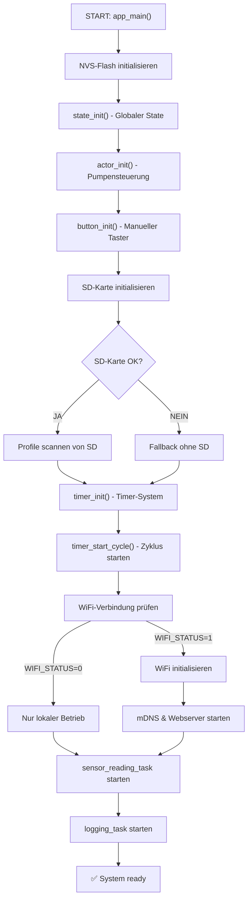
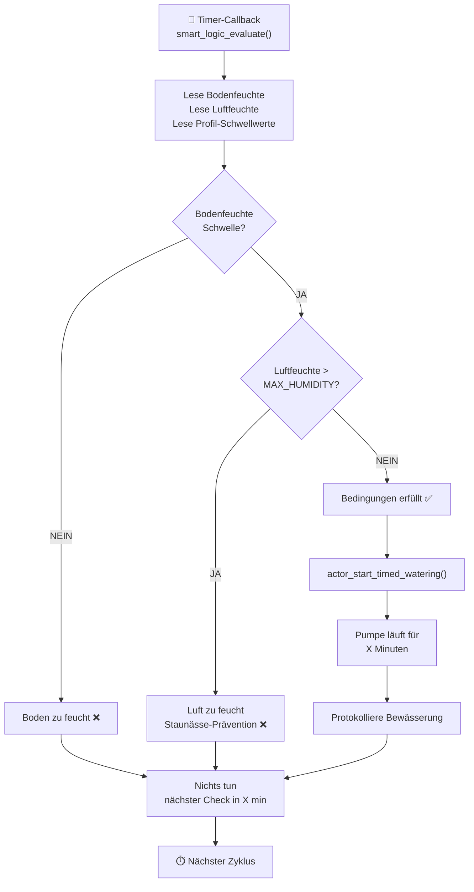
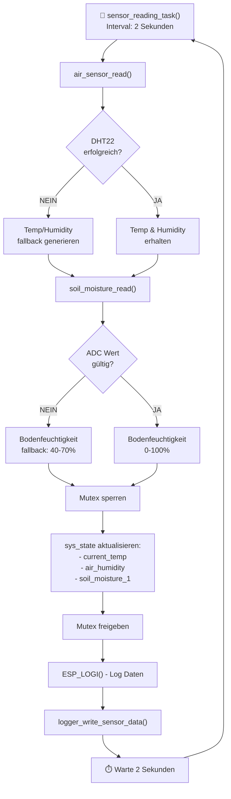
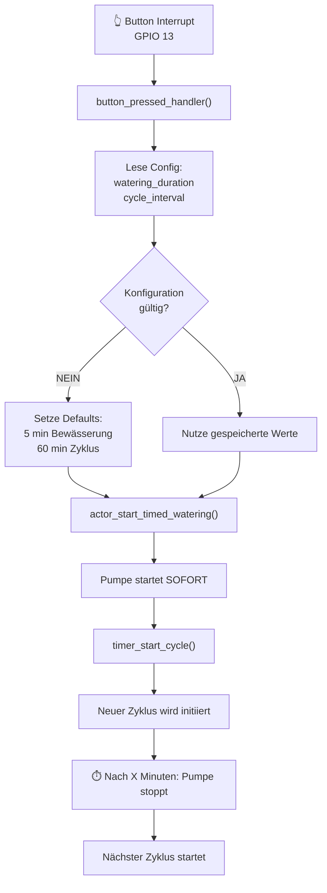
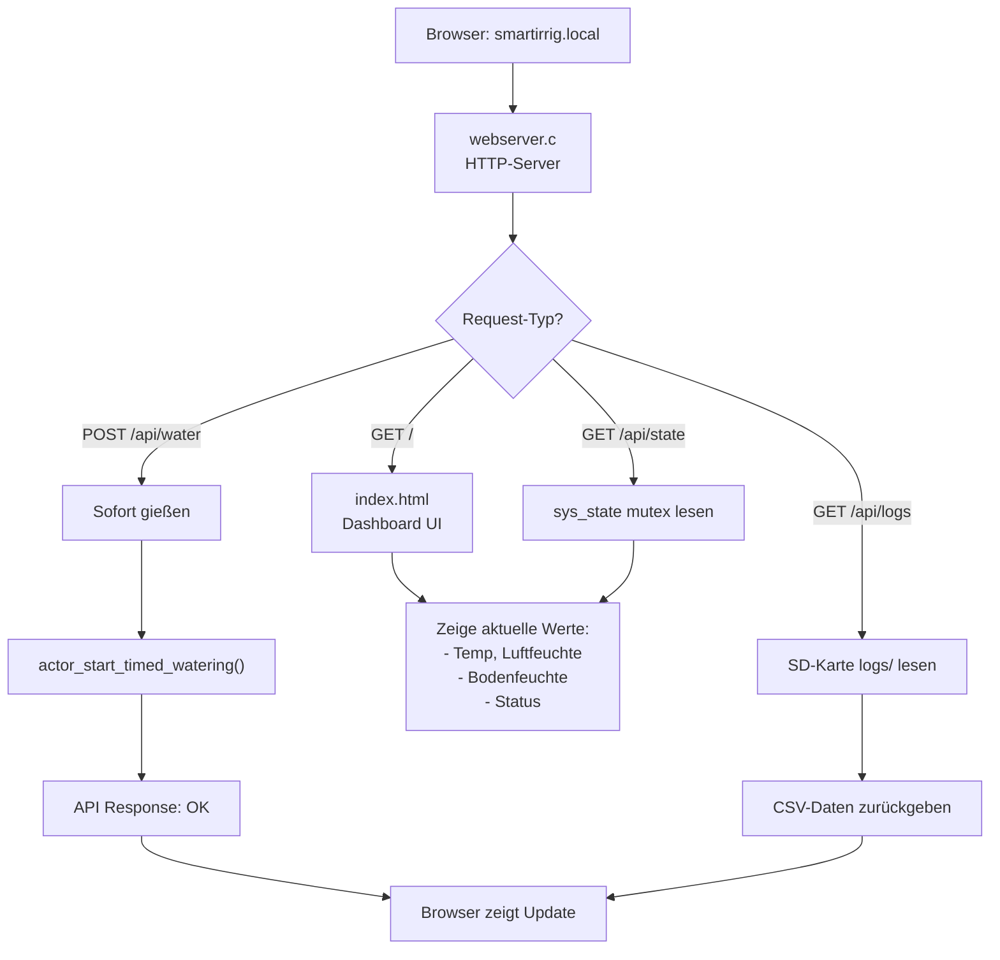
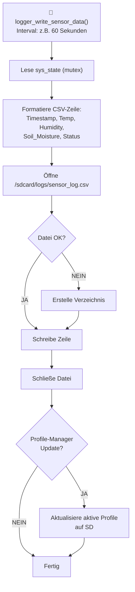
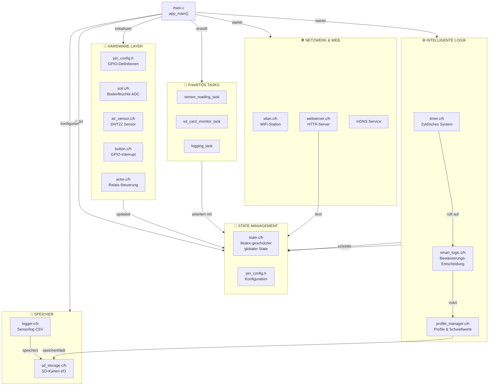

# 🪴 SmartIrrigation C3 – Projektdokumentation

## 📋 Projektübersicht

**SmartIrrigation C3** ist ein intelligentes, lokal laufendes Bewässerungssystem für Balkonpflanzen, basierend auf einem **ESP32-C3 Microcontroller**. Das System arbeitet völlig offline ohne Cloud-Abhängigkeit, verfügt über ein Web-Dashboard und speichert alle Logs und Bewässerungsprofile auf einer **SD-Karte**.

### 🎯 Kernziele

- ✅ **Lokale Intelligenz**: Smart-Logik zur Bewässerungsentscheidung basierend auf Bodenfeuchtigkeit und Luftfeuchte
- ✅ **Offline-Betrieb**: Keine Cloud-Abhängigkeit, lokales Web-Dashboard auf dem ESP32
- ✅ **Datenspeicherung**: Vollständige Sensordaten und Bewässerungsprotokolle auf SD-Karte
- ✅ **Multitasking**: FreeRTOS für parallele Sensorauslesungen und Systemoperationen
- ✅ **Manuell & Auto-Modi**: Taster für manuelle Bewässerung, zyklische automatische Bewässerung

---

## 🏗️ System-Architektur

Das Projekt folgt einer **modularen Architektur** mit klarer Separation of Concerns:

```
┌─────────────────────────────────────────────────────────────────┐
│                      APPLIKATIONSEBENE                          │
│  main.c – Systemstart, Initialisierung, Task-Verwaltung         │
└─────────────────────────────────────────────────────────────────┘
                              │
        ┌─────────────────────┼─────────────────────┐
        │                     │                     │
┌───────▼──────┐   ┌──────────▼────────┐   ┌──────▼─────────┐
│  HARDWARE    │   │  LOGIK & STATE    │   │   KOMMUNIKAT.  │
│  LAYER       │   │                   │   │   & SPEICHER    │
├──────────────┤   ├───────────────────┤   ├─────────────────┤
│• actor       │   │• state            │   │• webserver      │
│• button      │   │• timer            │   │• wlan           │
│• soil        │   │• smart_logic      │   │• sd_storage     │
│• air_sensor  │   │• profile_manager  │   │• logger         │
│• pin_config  │   │• logger           │   │                 │
└──────────────┘   └───────────────────┘   └─────────────────┘
```

---

## 📍 Hardware-Konfiguration

Alle GPIO-Zuordnungen sind zentral in `main/pin_config.h` definiert:

| Komponente | Funktion | GPIO-Pin | Typ |
|---|---|---|---|
| **Pumpen-Relais** | Wasserpumpe steuern | GPIO 4 | Digital Output |
| **Bodenfeuchtesensor** | Bodenfeuchtigkeit messen | GPIO 36 (ADC1) | Analog Input |
| **Air Sensor (DHT22)** | Temperatur & Luftfeuchte | GPIO 12 | Digital (1-Wire) |
| **Manueller Button** | Manuelle Bewässerung | GPIO 13 (Pulldown) | Digital Input |
| **SD-Karte MOSI** | SPI Datenleitung | GPIO 27 | SPI |
| **SD-Karte MISO** | SPI Datenleitung | GPIO 25 | SPI |
| **SD-Karte SCLK** | SPI Clock | GPIO 26 | SPI |
| **SD-Karte CS** | SPI Chip Select | GPIO 14 | SPI |

### 📁 SD-Karte Dateisystem

```
/sdcard/
├── logs/
│   └── sensor_log.csv        # Sensor-Telemetrie (Temp, Luftfeuchte, Bodenfeuchte)
└── profiles/
    └── [profile_name].json   # Bewässerungsprofile mit Schwellwerten
```

---

## 🧩 Modulare Komponenten

### 1. **Core State Management** (`state.c/h`)
- Globaler Systemzustand (`sys_state`)
- **Thread-Sicherheit**: FreeRTOS Mutex zur Vermeidung von Race Conditions
- Struktur enthält: Sensordaten, aktive Profile, Systemstatus

### 2. **Hardware-Treiber** (`hardware/`)

#### `actor.c/h` – Pumpensteuerung
- `actor_start_timed_watering()`: Startet Bewässerung für X Minuten
- `actor_stop()`: Stoppt Bewässerung
- Relais-Ansteuerung über GPIO 4

#### `soil.c/h` – Bodenfeuchte
- `read_soil_moisture()`: Liest ADC-Wert von GPIO 36
- Gibt Wert 0-100% zurück
- Fallback: Simuliert Werte bei Sensorfehler

#### `air_sensor.c/h` – DHT22
- `air_sensor_read()`: Liest Temperatur und Luftfeuchte
- Fallback-Werte bei Fehler
- Unterstützt GPIO 12 (1-Wire Protokoll)

#### `button.c/h` – Manuelle Steuerung
- Interrupt-basiert auf GPIO 13
- Callback: `button_pressed_handler()`
- Startet sofort Bewässerung + neuen Zyklus

### 3. **Logik & Timer** (`logic/`)

#### `timer.c/h` – Zyklisches System
- `timer_start_cycle()`: Startet periodischen Bewässerungs-Check
- Registriert Callbacks für jeden Zyklus
- Nutzt `smart_logic_evaluate()` zur Entscheidung

#### `smart_logic.c/h` – Intelligente Bewässerung
- **Entscheidungslogik**:
  - ✅ Gießen wenn: Bodenfeuchte < Schwelle UND Luftfeuchte < Max
  - ❌ Nicht gießen wenn: Zu nass ODER Luft zu feucht (Staunässe-Prävention)
- Nutzt aktives Profil aus `profile_manager`

#### `profile_manager.c/h` – Bewässerungsprofile
- Speichert Schwellwerte und Check-Intervalle
- Lädt Profile von SD-Karte
- Mehrere Profile möglich (z.B. "Tomaten", "Erdbeeren", "Basilikum")

#### `logger.c/h` – Datenlogging
- Schreibt Sensordaten periodisch auf SD-Karte
- CSV-Format für einfache Analyse
- Task: `xTaskCreate(..., "logging_task", ...)`

### 4. **Kommunikation** (`web/`)

#### `wlan.c/h` – WiFi-Verbindung
- `wifi_init_sta()`: Verbindung zu SSID/Passwort
- Startet mDNS-Service (Zugriff via `http://smartirrig.local`)

#### `webserver.c/h` – REST-API
- HTML-Dashboard (`index.html`)
- REST-Endpoints für:
  - GET `/api/state` → Aktuelle Sensordaten
  - POST `/api/water` → Sofort Bewässerung
  - GET `/api/logs` → Letzte Logs

#### `sd_storage.c/h` – SD-Kartenverwaltung
- Initialisierung und Fehlerbehandlung
- Dateischreib/-lesevorgänge
- Self-Test vor Verwendung

---

## 🔄 Systemfluss & Ablauf

### Startup-Sequenz

```
app_main() aufgerufen
    ↓
1. NVS-Flash initialisieren (Persistente Speicherung)
    ↓
2. State & Actor-System initialisieren
    ↓
3. Button-Interrupt einrichten
    ↓
4. SD-Karte initialisieren + self-test
    ↓
5. Timer starten (Bewässerungs-Zyklen)
    ↓
6. WiFi & Webserver starten (optional, wenn WIFI_STATUS=1)
    ↓
7. Sensor-Reading-Task starten (FreeRTOS)
    ↓
✅ System läuft
```

### Normaler Bewässerungs-Zyklus

```
Timer-Callback aufgerufen (alle X Minuten)
    ↓
smart_logic_evaluate() ausgeführt
    ↓
Liegt Bodenfeuchte unter Schwelle?
    ├─ JA → Prüfe Luftfeuchte
    │   ├─ Zu feucht? → Nicht gießen (Staunässe-Prävention)
    │   └─ Normal? → actor_start_timed_watering()
    │       ↓
    │       Pumpe läuft für X Minuten
    │
    └─ NEIN → Nichts tun (zu feucht)
```

### Sensor-Auslesung

```
Sensor-Reading-Task (2s Intervall, FreeRTOS)
    ↓
Lese DHT22 (Temperatur, Luftfeuchte)
Lese Bodenfeuchtesensor (ADC)
    ↓
Mutex sperren (thread-safe)
    ↓
Schreibe in sys_state Struktur
    ↓
Mutex freigeben
    ↓
Logging (async, zur SD-Karte)
```

### Manuelle Bedienung

```
Button gedrückt (Interrupt auf GPIO 13)
    ↓
button_pressed_handler() aufgerufen
    ↓
actor_start_timed_watering() mit konfig. Dauer
    ↓
timer_start_cycle() mit neuem Check-Intervall
    ↓
Pumpe läuft, dann nächster Zyklus startet
```

---

## 🔄 Detailliertes Systemflowchart

### Flowchart 1: Systemstart (app_main)



### Flowchart 2: Bewässerungs-Entscheidungslogik



### Flowchart 3: Sensor-Auslesung (Multitasking)



### Flowchart 4: Manueller Button-Betrieb



### Flowchart 5: Web-Dashboard & API



### Flowchart 6: SD-Karten-Logging



### Flowchart 7: Gesamt-Systemarchitektur (Komponenten-Übersicht)



---

## 🎯 Workflow-Beispiele

### Beispiel 1: Automatische Bewässerung

```
T=0:00   - System startet
T=0:30   - Sensor misst: Boden 35%, Luft 60%
T=1:00   - Timer-Zyklus: Boden < 40% Schwelle → GIESZEN STARTEN
T=1:05   - Pumpe läuft 5 Minuten
T=1:10   - Pumpe stoppt, nächster Zyklus in 60 min
T=2:10   - Sensor misst: Boden 65% → Trocknend
T=3:10   - Timer-Zyklus: Boden > 40% Schwelle → Nicht gießen
...
```

### Beispiel 2: Manueller Button-Druck

```
T=2:15   - Benutzer drückt Button
T=2:15   - actor_start_timed_watering(5 min) startet
T=2:15   - timer_start_cycle(60 min, 5 min) neu initiiert
T=2:20   - Nach 5 Minuten: Pumpe stoppt automatisch
T=3:20   - Nächster Zyklus beginnt
```

### Beispiel 3: Staunässe-Prävention

```
T=0:00   - Intensives Bewässerungsverbot wegen Regenwasser
T=0:30   - Sensor: Boden 75%, Luft 85% (sehr feucht!)
T=1:00   - Timer-Zyklus: Boden < Schwelle, aber Luft > 80%
         → Smart-Logik entscheidet: NICHT GIESZEN (Staunässe-Prävention)
T=2:00   - Nach 1 Stunde Verdunstung: Boden 60%, Luft 70%
T=2:00   - Nächster Zyklus: Luft normal → Falls Boden < Schwelle: GIESZEN OK
```

---

## 📊 Wichtige Konfigurationen

### `main/pin_config.h`
- GPIO-Zuordnungen für alle Sensoren und Aktoren
- SD-Karten-Mountpoint und Dateipfade
- Schwellwerte für Sensoren

### `main/state.h`
```c
struct {
    float current_temp;
    float air_humidity;
    int soil_moisture_1;
    struct active_profile active_profile;
    int watering_active;
    // ... weitere Felder
} sys_state;
```

### Profile (JSON auf SD-Karte)
```json
{
  "name": "Tomate",
  "soil_moisture_threshold": 35,
  "max_humidity": 80,
  "check_interval_minutes": 60,
  "watering_duration_minutes": 5
}
```

---

## 🔧 Erweiterungsmöglichkeiten

1. **Mehrere Sensoren**: Zweite Bodenfeuchte-Sonde für große Pflanzen
2. **Wetteranbindung**: Regen-API integrieren (lokal mit WLAN)
3. **Machine Learning**: Bewässerungsmuster lernen
4. **Benachrichtigungen**: Email/Push bei Fehler
5. **Mobile App**: Native App statt Web-Dashboard
6. **Datenexport**: Grafische Analyse der Logs
7. **PWM-Pumpen**: Variable Wassermenge statt On/Off

---

## 🐛 Debugging-Tipps

- **Logs**: `ESP_LOGI(TAG, "...")` in main.c definieren
- **Mutex-Deadlock**: Timeout `MUTEX_TIMEOUT_MS` in pin_config.h
- **SD-Fehler**: Self-Test mit `sd_card_self_test()` im Startup
- **Sensor-Fehler**: Fallback-Werte werden automatisch generiert
- **WiFi**: mDNS Service erlaubt Zugriff via `http://smartirrig.local`

---

## 📚 Dateistruktur

```
main/
├── main.c                   # Systemstart & Koordination
├── pin_config.h             # GPIO & Pfad-Konfiguration
├── state.c/h                # Globaler State (mutex-geschützt)
│
├── hardware/
│   ├── actor.c/h            # Pumpen-/Relaissteuerung
│   ├── button.c/h           # Button-Handler
│   ├── soil.c/h             # Bodenfeuchtesensor
│   └── air_sensor.c/h       # DHT22 Sensor
│
├── logic/
│   ├── timer.c/h            # Zyklisches System
│   ├── smart_logic.c/h      # Intelligente Logik
│   ├── profile_manager.c/h  # Profile & Schwellwerte
│   └── logger.c/h           # Sensorlog
│
└── web/
    ├── wlan.c/h             # WiFi-Verbindung
    ├── webserver.c/h        # HTTP-Server & API
    ├── index.html           # Web-Dashboard
    └── sd_storage.c/h       # SD-Kartenverwaltung
```

---

## ✅ Checkliste für Inbetriebnahme

- [ ] GPIO-Pins in `pin_config.h` überprüfen
- [ ] SD-Karte formatiert und bereit
- [ ] Profile auf SD-Karte erstellen (`/sdcard/profiles/`)
- [ ] WiFi-Credentials in `wlan.c` eintragen (oder extern laden)
- [ ] Sensoren kalibrieren (Bodenfeuchtigkeit 0-100%)
- [ ] Erste Bewässerung testen (manueller Button)
- [ ] Logs auf SD überprüfen
- [ ] Web-Dashboard öffnen: `http://smartirrig.local`
- [ ] Zyklische Bewässerung im Monitor beobachten

---

## 📞 Zusammenfassung

**SmartIrrigation C3** ist ein vollständiges, intelligentes Bewässerungssystem mit:
- ✅ Modularer Architektur
- ✅ Thread-sicheren Operationen (FreeRTOS Mutexes)
- ✅ Intelligenter Entscheidungslogik
- ✅ Lokaler Datenspeicherung
- ✅ Web-Interface für Fernbedienung
- ✅ Extensible für zukünftige Features

Das System ist produktionsreif und kann direkt auf einem ESP32-C3 deployed werden!

