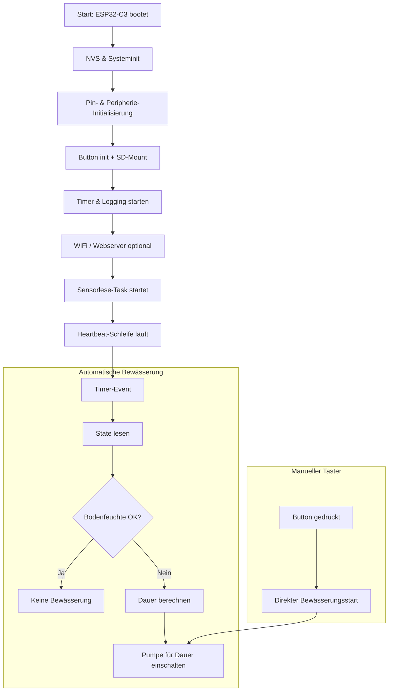

# 🪴 SmartIrrigation C3 – Smartes Balkon-Bewässerungssystem

Dieses Projekt baut ein lokal laufendes Bewässerungssystem für Balkonpflanzen auf Basis eines **ESP32-C3 (RISC-V)**. Es nutzt **FreeRTOS** für Multitasking, stellt ein **lokales Web-Dashboard** bereit und speichert **Logs und Bewässerungsprofile auf einer SD-Karte**.

## 🎯 Projektidee

Das System ist bewusst ohne Cloud konzipiert:
* lokale Entscheidungslogik für smarte Bewässerung
* Web-Dashboard direkt auf dem ESP32-C3
* Profile und Logs auf SD-Karte gespeichert
* thread-sicherer globaler Systemzustand über FreeRTOS-Mutex

## 📌 Hardware & Pin-Konfiguration

Die Hardware-Pins sind zentral in `main/pin_config.h` abgelegt. Dort findest du die wichtigsten Zuordnungen für Relais, SD-Karte, Sensoren und den manuellen Taster.

### Aktuelle GPIO-Belegung

| Funktion | Makro | Pin |
|---|---|---|
| Relais / Pumpe | `GPIO_RELAY` | GPIO 4 |
| SD-Karte MOSI | `GPIO_SD_MOSI` | GPIO 27 |
| SD-Karte MISO | `GPIO_SD_MISO` | GPIO 25 |
| SD-Karte SCLK | `GPIO_SD_SCLK` | GPIO 26 |
| SD-Karte CS | `GPIO_SD_CS` | GPIO 14 |
| DHT22 Sensor | `GPIO_DHT22` | GPIO 12 |
| Bodenfeuchtigkeit (ADC1) | `GPIO_SOIL_MOISTURE` | GPIO 36 |
| Manueller Taster (Pulldown) | `GPIO_BUTTON` | GPIO 13 |

### SD-Dateipfade

`main/pin_config.h` definiert auch die Pfade für das SD-Dateisystem:
* `SD_MOUNT_POINT` → `/sdcard`
* `SD_LOG_DIR` → `/sdcard/logs`
* `SD_PROFILE_DIR` → `/sdcard/profiles`
* `SD_LOG_FILE` → `/sdcard/logs/sensor_log.csv`

Diese Pfade werden im SD-Modul verwendet, damit alle Dateizugriffe konsistent bleiben.

## 🧱 Software-Architektur

Das Projekt ist modular aufgebaut, damit jede Komponente nur eine Aufgabe übernimmt.

### Wichtige Module

* `main.c` – Systemstart, Initialisierung und zyklische Smart-Logik
* `state.c` / `state.h` – globaler Systemzustand mit Mutex-Schutz
* `actor.c` / `actor.h` – Pumpen-/Relaissteuerung
* `wlan.c` / `wlan.h` – WiFi-Station und Webserver-Start
* `webserver.c` / `webserver.h` – HTTP-Server und REST-API
* `timer.c` / `timer.h` – Bewässerungs- und Logging-Timer
* `logger.c` / `logger.h` – CSV-Logging von Sensordaten
* `sd_storage.c` / `sd_storage.h` – SD-Karten-Mount, Log- und Profilzugriff
* `profile_manager.c` / `profile_manager.h` – Scannen und Aktivieren von Bewässerungsprofilen
* `dht22.c` / `dht22.h` – DHT22-Temperatur-/Feuchtigkeitsmessung
* `soil.c` / `soil.h` – Bodenfeuchtemessung
* `pin_config.h` – zentrale Pin- und Pfaddefinitionen

## 🔄 Prozessablauf

Der Projektfluss umfasst die Initialisierung, zyklische Sensorauswertung und automatische Bewässerung.



## 📊 Kernfunktionen

### Web-Dashboard
Das Web-Dashboard wird eingebettet und lokal ausgeliefert. Es zeigt:
* Temperatur
* Luftfeuchtigkeit
* Bodenfeuchtigkeit
* Countdown bis zur nächsten automatischen Bewässerung
* Profilauswahl
* Zyklus- und Dauersteuerung
* Direkten Pumpenschalter

### SD-Karte & Profile
Die SD-Karte wird per SPI eingebunden und automatisiert in folgende Ordner strukturiert:
* `/sdcard/logs`
* `/sdcard/profiles`

Profildateien liegen als `.json` im Profilordner und können per Web-API geladen werden.

### Thread-sicherer Zustand
Alle gemeinsamen Daten werden in `sys_state` gehalten und nur nach erfolgreichem `xSemaphoreTake(state_mutex, ...)` gelesen oder geschrieben. So werden Race Conditions vermieden.

## 🔧 Build & Nutzung

### Voraussetzungen
* Installierte ESP-IDF Umgebung
* Funktionierende SD-Karte
* WLAN-Zugangsdaten via `menuconfig`

### Build
```bash
cd "Smart_Plant_Irigation"
idf.py menuconfig
idf.py build
idf.py flash
```

### Laufend
* Das Web-Dashboard ist nach dem Start über die IP-Adresse des ESP erreichbar oder auch über `bewaesserung.local`
* Profile werden beim Start von der SD-Karte eingelesen
* Logs werden periodisch in `sensor_log.csv` geschrieben

## 💡 Hinweise

* `dht22.c` ist die aktuelle Sensoranbindung für Temperatur und Luftfeuchte.
* `temp.c` kann zusätzlich den internen C3-Temperatursensor nutzen.
* Der manuelle Taster (`GPIO_BUTTON`) ist als Pulldown-Taster ausgelegt.
* Alle Hardware-Pins werden aus `main/pin_config.h` geladen.

---

Mit dieser Struktur kannst du das Projekt leicht erweitern: zusätzliche Sensoren, neue Profile oder weitere Relaisausgänge lassen sich zentral konfigurieren.